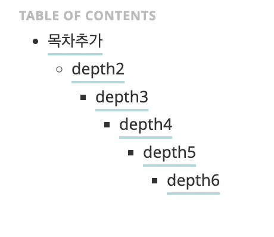

* toc
{:toc}

## Hydejack 테마 기준 글쓰기 예시
### Ⅰ. 서론
*  Hydejack 테마를 이용하여 Github Blog를 사용할 때, 기본적인 마크다운 문법을 제외하고,<br> Hydejack에서 가지고 있는 고유 문법들을 정리하는 글입니다.<br> 포스트를 쓸 때 참고하면 좋을 것 같습니다.

### Ⅱ. 본론
#### 01. 목차 추가

~~~yml
---
layout: post
title: "Github Blog 만들기 #3 - Hydejack 글쓰기 문법 예시" 
image: /assets/img/post/blog/example-content-ii.jpg
sitemap: false
categories: [depth1,depth2]
tags: [anytag]
---
* toc
{:toc}
~~~

-  위의 내용과 같이 글 최상단에 toc을 붙이면 목차가 생깁니다.

~~~yml
## depth2
### depth3
#### depth4
##### depth5
###### depth6
~~~



*  클릭하면 해당 위치로 이동합니다.

#### 02. Note 추가
*  특정 문단이나 문구 밑에 사족을 달 때 사용합니다.

	이렇게 노트를 쓰면 됩니다.
	{:.note}

~~~yml
이렇게 노트를 쓰면 됩니다.
{:.note}
~~~

#### 03. 큰 텍스트
*  강조나 맥락 전환용으로 쓰면 좋을 것 같네요.

	이렇게 큰 텍스트를 쓰면 됩니다.
	{:.lead}

~~~yml
이렇게 큰 텍스트를 쓰면 됩니다.
{:.lead}
~~~

#### 04. 이미지 Caption
*  이미지에 설명을 달아줄 수 있습니다.<br> 특정 이미지 밑에 아래와 같이 작성하면 됩니다.

~~~yml
{:.lead width="800" height="100" loading="lazy"}
귀여운 이미지네요.
{:.figcaption}
~~~

{:.lead width="800" height="100" loading="lazy"}
귀여운 이미지네요.
{:.figcaption}

#### 05. 인용문 강조
*  인용문을 강조할 때 사용합니다.

~~~yml
> 인용문입니다.
> 일반적인 인용문이에요.

> 이건 하이드잭 테마를 적용시켰습니다.
> 어떤가요?
{:.lead}
~~~

> 인용문입니다.
> 일반적인 인용문이에요.

> 이건 하이드잭 테마를 적용시켰습니다.
> 어떤가요?
{:.lead}

#### 06. 흐릿한 텍스트
*  중요하지 않은 정보를 흐릿하게 처리하고 싶을 때 쓰면 될 것 같습니다.

~~~yml
이건 일반적인 텍스트입니다.<br>

그리고 저는 흐려지는 텍스트 입니다.<br>
{:.faded}
~~~

이건 일반적인 텍스트입니다.<br>

그리고 저는 흐려지는 텍스트 입니다.<br>
{:.faded}

#### 07. 테이블 처리
##### 07-1. 테이블에 대한 기본 문법
*  테이블에 대한 문법입니다.<br> `:` 의 위치에 따라 내용 정렬이 달라집니다.<br>
> |--------|:--------|:------:|----------:|

~~~yml

| 기본정렬 | 왼쪽 정렬 | 중간 정렬 | 오른쪽 정렬 |
|--------|:--------|:------:|----------:|
| 기본    | 왼      |   중    |         오 |

~~~

| 기본정렬 | 왼쪽 정렬 | 중간 정렬 | 오른쪽 정렬 |
|------|:------|:-----:|-------:|
| 기본   | 왼     |   중   |      오 |

##### 07-2. 테이블이 길거나 크다면?
*  아래와 같이 테이블이 길거나 크다면 Hydejack은 그냥 가로 크기에 맞춰 테이블을 줄여버립니다.<br> 내용을 읽기 힘들겠지만 다행히 가로 스크롤을 제공합니다.

~~~yml
이건 기본적으로 가로에 맞춰주는 테이블이에요.<br>

| 기본정렬 | 왼쪽 정렬 | 중간 정렬 | 오른쪽 정렬 |기본정렬 | 왼쪽 정렬 | 중간 정렬 | 오른쪽 정렬 | 기본정렬 | 왼쪽 정렬 | 중간 정렬 | 오른쪽 정렬 |기본정렬 | 왼쪽 정렬 | 중간 정렬 | 오른쪽 정렬 |
|--------|:--------|:------:|----------:|-------|:--------|:------:|----------:|-------|:--------|:------:|----------:|-------|:--------|:------:|----------:|
| 기본    | 왼      |   중    |         오 | 기본    | 왼      |   중    |         오 | 기본    | 왼      |   중    |         오 | 기본    | 왼      |   중    |         오 |


이건 하단에 스크롤 설정을 넣은 테이블입니다.<br>

| 기본정렬 | 왼쪽 정렬 | 중간 정렬 | 오른쪽 정렬 |기본정렬 | 왼쪽 정렬 | 중간 정렬 | 오른쪽 정렬 | 기본정렬 | 왼쪽 정렬 | 중간 정렬 | 오른쪽 정렬 |기본정렬 | 왼쪽 정렬 | 중간 정렬 | 오른쪽 정렬 |
|--------|:--------|:------:|----------:|-------|:--------|:------:|----------:|-------|:--------|:------:|----------:|-------|:--------|:------:|----------:|
| 기본    | 왼      |   중    |         오 | 기본    | 왼      |   중    |         오 | 기본    | 왼      |   중    |         오 | 기본    | 왼      |   중    |         오 |
{:.scroll-table}
~~~

*  이건 기본적으로 가로에 맞춰주는 테이블이에요.<br>

| 기본정렬 | 왼쪽 정렬 | 중간 정렬 | 오른쪽 정렬 | 기본정렬 | 왼쪽 정렬 | 중간 정렬 | 오른쪽 정렬 | 기본정렬 | 왼쪽 정렬 | 중간 정렬 | 오른쪽 정렬 | 기본정렬 | 왼쪽 정렬 | 중간 정렬 | 오른쪽 정렬 |
| ---- | :---- | :---: | -----: | ---- | :---- | :---: | -----: | ---- | :---- | :---: | -----: | ---- | :---- | :---: | -----: |
| 기본   | 왼     |   중   |      오 | 기본   | 왼     |   중   |      오 | 기본   | 왼     |   중   |      오 | 기본   | 왼     |   중   |      오 |


*  이건 하단에 스크롤 설정을 넣은 테이블입니다.<br>

| 기본정렬 | 왼쪽 정렬 | 중간 정렬 | 오른쪽 정렬 | 기본정렬 | 왼쪽 정렬 | 중간 정렬 | 오른쪽 정렬 | 기본정렬 | 왼쪽 정렬 | 중간 정렬 | 오른쪽 정렬 | 기본정렬 | 왼쪽 정렬 | 중간 정렬 | 오른쪽 정렬 |
| ---- | :---- | :---: | -----: | ---- | :---- | :---: | -----: | ---- | :---- | :---: | -----: | ---- | :---- | :---: | -----: |
| 기본   | 왼     |   중   |      오 | 기본   | 왼     |   중   |      오 | 기본   | 왼     |   중   |      오 | 기본   | 왼     |   중   |      오 |
{:.scroll-table}


##### 07-3. 테이블이 작은데 맞추고 싶다면?
*  테이블이 커도 문제지만 너무 작아도 보기 좋지 않습니다.<br> 그래서 가로가 꽉 차게 양식을 맞춰줄 때도 있습니다.

~~~yml
이건 일반 테이블 생성입니다.<br>

| 기본정렬 | 왼쪽 정렬 | 중간 정렬 | 오른쪽 정렬 |
|--------|:--------|:------:|----------:|
| 기본    | 왼      |   중    |         오 |

이건 가로 맞춤 설정을 넣은 모습입니다.<br>

| 기본정렬 | 왼쪽 정렬 | 중간 정렬 | 오른쪽 정렬 |
|--------|:--------|:------:|----------:|
| 기본    | 왼      |   중    |         오 |
{:.stretch-table}
테이블에도 캡션을 넣을 수 있습니다.
{:.figcaption}
~~~

*  이건 일반 테이블 생성입니다.<br>

| 기본정렬 | 왼쪽 정렬 | 중간 정렬 | 오른쪽 정렬 |
| ---- | :---- | :---: | -----: |
| 기본   | 왼     |   중   |      오 |

*  이건 가로 맞춤 설정을 넣은 모습입니다.<br>

| 기본정렬 | 왼쪽 정렬 | 중간 정렬 | 오른쪽 정렬 |
|--------|:--------|:------:|----------:|
| 기본    | 왼      |   중    |         오 |
{:.stretch-table}
테이블에도 캡션을 넣을 수 있습니다.
{:.figcaption}

테이블의 밑에도 Caption을 넣어 설명해줄 수 있습니다.
{:.note}

#### 08. 코드 블럭
*  제가 구글을 통해 마크다운 문법들을 찾아보게 된 계기인 것 같습니다.<br> 여러가지 방법이 있겠지만, 참고한 블로그 중 가장 깔끔하게 되어있었습니다.

~~~yml

#~~~java
#//file: `Test.java` 요 부분은 파일이름 헤더 기능으로 각 언어에 맞게 주석처리를 해야합니다.

#System.out.println("test");
#~~~

~~~


~~~java
//file: `Test.java`

System.out.println("test");
~~~
*  위에서도 적혀 있지만, 파일이름 헤더 기능은 반드시 **각 언어에 맞게 주석 처리를 해야합니다**.<br> 그리고 코드 블럭 가장 첫 번째 줄에 주석이 들어갈 경우 파일이름 헤더 기능으로  인식되어<br> 해당 코드 블럭이 제대로 인식되지 못하는 경우를 보았습니다.<br> **반드시 첫 번째 줄의 주석은 파일 헤더 기능으로 인식될 수 있으니 조심하세요.**

#### 09. html 파일 작성시 주의
*  html 파일에 있는 Liquid 템플릿 엔진의 문법은 ~~~ 주석안에 넣어도 코드로 인식하지 못하는 경우가 있습니다.

```html

  
  
  
  


```
Liquid 템플릿 엔진의 문법
{:.figcaption}

*  이런아이들은 html 주석 헤더와 푸터에 [raw태그](https://shopify.dev/docs/api/liquid/tags/raw) 를 넣어주면 그대로 출력 될 것입니다.<br> 이 글에서 해당 태그를 어떤 식으로든 작성해서 보여줄 수가 없어서 링크로 대체합니다.

```html

여기에 raw


  
  
  
  


여기에 endraw

```

#### 10. 수학 블럭
*  수학공식에 대한 문법 지원도 해줍니다.<br> 알고리즘 DP같은 글 정리할 때 공식을 정리할 때 사용할 듯 합니다.

~~~latex
Lorem ipsum $$ f(x) = x^2 $$
~~~

Lorem ipsum $$ f(x) = x^2 $$

~~~latex
$$
\begin{aligned} %!!15
  \phi(x,y) &= \phi \left(\sum_{i=1}^n x_ie_i, \sum_{j=1}^n y_je_j \right) \\[2em]
            &= \sum_{i=1}^n \sum_{j=1}^n x_i y_j \phi(e_i, e_j)            \\[2em]
            &= (x_1, \ldots, x_n)
               \left(\begin{array}{ccc}
                 \phi(e_1, e_1)  & \cdots & \phi(e_1, e_n) \\
                 \vdots          & \ddots & \vdots         \\
                 \phi(e_n, e_1)  & \cdots & \phi(e_n, e_n)
               \end{array}\right)
               \left(\begin{array}{c}
                 y_1    \\
                 \vdots \\
                 y_n
               \end{array}\right)
\end{aligned}
$$

An optional caption for a math block
{:.figcaption}
~~~

$$
\begin{aligned}
  \phi(x,y) &= \phi \left(\sum_{i=1}^n x_ie_i, \sum_{j=1}^n y_je_j \right) \\[2em]
            &= \sum_{i=1}^n \sum_{j=1}^n x_i y_j \phi(e_i, e_j)            \\[2em]
            &= (x_1, \ldots, x_n)
               \left(\begin{array}{ccc}
                 \phi(e_1, e_1)  & \cdots & \phi(e_1, e_n) \\
                 \vdots          & \ddots & \vdots         \\
                 \phi(e_n, e_1)  & \cdots & \phi(e_n, e_n)
               \end{array}\right)
               \left(\begin{array}{c}
                 y_1    \\
                 \vdots \\
                 y_n
               \end{array}\right)
\end{aligned}
$$

An optional caption for a math block
{:.figcaption}


### Ⅲ. 결론
*  더 자세한 내용은 [Hydejack 공식 문서](https://hydejack.com/docs/writing/#adding-a-table-of-contents)와 구글을 통해 더 많은 정보를 검색해볼 필요가 있을 것 같습니다.<br> 편하게 글을 쓰는 방법은 [Prose.io](https://Prose.io) 를 사용하거나 현재의 저처럼 Obsidian을 이용하면 될 것 같습니다.<br> 마크다운의 경우 적응하는데 시간이 아직 필요한 것으로 보이지만,<br> 열심히 블로그 생활을 하다보면 실력이 늘지 않을까 생각합니다.<br> 감사합니다.

### Ⅳ. 참고문헌
1.  [nomoreft님의 Github Blog](https://nomoreft.github.io/devlog/blog/2023-09-28-%EA%B8%80%EC%93%B0%EA%B8%B0-%ED%85%8C%EC%8A%A4%ED%8A%B8%EC%9A%A9/)  (Github Blog 만들기 #5 - Hydejack 글쓰기 문법 예시)