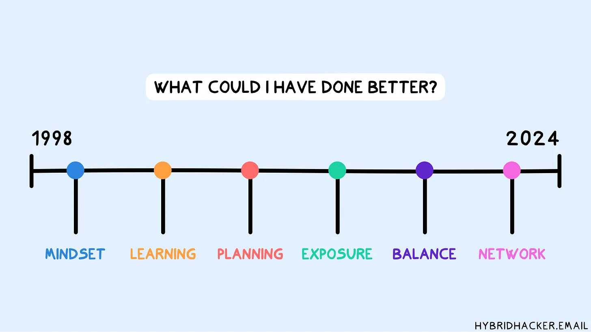
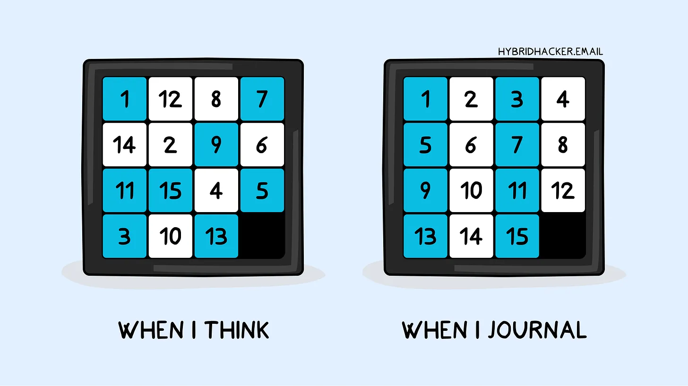
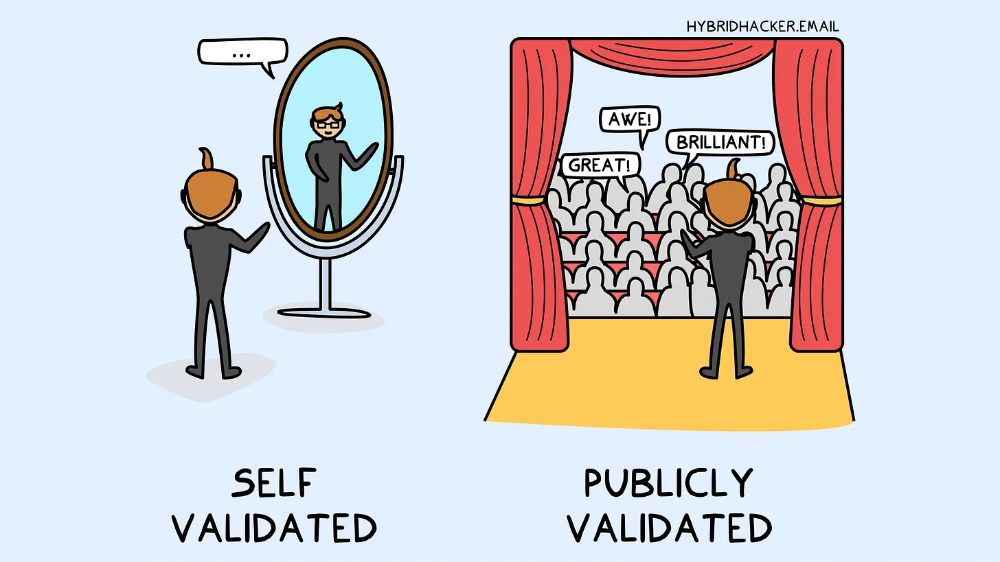

* toc
{:toc}

## 시니어 엔지니어가  18살로 돌아간다면 꼭 하고 싶은 10가지
### Ⅰ. 서론
앞으로 개발자로서 또는 한 명의 사회인으로 서, 어떻게 삶을 살아가야 할지 고민을 자주 하게 되는 것 같습니다.  이 글은 25년 경력의 실리콘밸리 베테랑 엔지니어 니콜라 발로타가 쓴 <25년 엔지니어링 경력 회고록>을 번역한   뉴스레터를 읽으면서 저의 삶에 대한 생활과 경력을 어떻게 개선해야 할 지, 생각을 해보게 되었습니다.

### Ⅱ. 본론
아래의 내용은 참조한 뉴스레터의 전문입니다.

---

개발자 여러분, 시간을 되돌릴 수 있다면 무엇을 하고 싶으신가요? 특히 지금의 지식과 경험을 가지고 18살로 돌아갈 수 있다면 말이죠. [25년 경력의 실리콘밸리 베테랑 엔지니어 니콜라 발로타가 바로 그 상상의 나래를 펼쳤습니다.](https://hybridhacker.email/p/my-25-year-engineering-career-retrospective?utm_source=%2Finbox%2Fsaved&utm_medium=reader2) 그가 쓴 <25년 엔지니어링 경력 회고록>을 번역해 가져왔는데요. 그가 경력을 되돌아보며 털어놓은 후회와 교훈은 놀랍도록 현실적이고 가슴에 와닿습니다.

-   _"미루는 습관을 더 일찍 고쳤더라면..."_
-   _"경쟁보다는 협력에 집중했더라면..."_
-   _"코딩을 더 열심히 했더라면..."_

이런 고백들이 여러분에게는 어떻게 다가오시나요? 혹시 지금 이 순간에도 비슷한 고민을 하고 계신건 아닌가요?

니콜라의 회고록은 단순한 후회의 나열이 아닙니다. 그의 25년 경험이 응축된 이 글은 지금 이 순간 엔지니어링 커리어를 고민하는 모든 이들에게 농축된 인사이트를 제공합니다. 마인드셋부터 기술 습득, 네트워킹까지. 성공적인 엔지니어가 되기 위한 모든 것이 이 글에 담겨 있습니다.

___

며칠 전, 자주 그렇듯이 새벽 4시에 잠에서 깨어 침대에 누워 있었습니다. 그때 문득 18살이었던 25년 전으로 돌아갈 수 있다면 내 경력에서 무엇을 다르게 했을지 생각해 보기 시작했습니다.

5시 30분에 일어나 메모를 하고, 이후 며칠 동안 그 메모를 이 에세이로 발전시키기로 했습니다. 현재의 제 위치에 불만족해서가 아니라, 개인 생활과 경력에서 여전히 개선이 필요한 부분을 찾기 위해 이런 회고를 자주 합니다.

제가 해온 일에 대해 크게 후회하는 것은 없지만, 엔지니어링 경력을 고려하고 있거나 이미 그 길을 걷고 있는 분들에게 이 글이 도움이 되거나 최소한 영감을 줄 수 있을 것 같습니다.

편의를 위해 모든 내용을 카테고리로 나누었고, 다음과 같은 주제를 다룰 것입니다:

-   🔥 마인드셋과 생산성
-   📚 학습
-   👨💼 경력 계획
-   🗣️ 대중 앞에서 드러내기
-   ⚖️ 일과 삶의 균형
-   🌐 멘토링과 네트워킹

### 🔥 마인드셋과 생산성

어릴 때부터 저는 시간과 어떻게 하면 더 많은 시간을 절약할 수 있을지에 대해 집착했습니다.

아마도 이 때문인지 제 몸이 하루 4-6시간만 자는 것에 익숙해졌습니다. 그래서 지금도 여전히 새벽 4시에 깨어나 25년 전에 무엇을 더 잘할 수 있었을지 고민하고 있는 것 같습니다 🙂

그럼에도 불구하고, 잠을 줄여 절약한 시간을 항상 잘 활용하지는 못했습니다. 오늘날에는 시간 활용을 잘하고 있다고 생각하지만, 여전히 개선할 방법을 찾고 있습니다.

#### 미루는 습관 줄이기

특히 20대에는 미루는 습관이 흔합니다. 이는 성인이 되면서 느끼는 혼란과 연관이 있다고 봅니다.

> 무엇을 공부해야 할까? 어떤 경력 경로를 선택해야 할까? 어디서 살아야 할까?

이런 질문들에 대답하기 어려워 일종의 정체 상태에 빠지게 되고, 그 결과 미루는 습관이 생길 가능성이 높습니다.

젊은 나이에 많은 사람들에게 자연스럽게 일어나는 일이지만, 중요한 것은 이에 익숙해지지 않는 것입니다. 초기 경력에서 미루는 습관으로 얼마나 많은 시간을 낭비했는지 헤아릴 수 없을 정도예요.

#### 💡 다르게 했다면?

-   미루는 습관이 어떻게 작용하는지 이해했을 것입니다. 적을 알아야 한다는 말처럼 말이죠. 오늘날에는 쉽게 접근할 수 있는 많은 자료가 있습니다.
-   SMART 목표를 사용해 내가 달성하고자 하는 바를 정의했을 것입니다.
-   일정표를 사용해 하루를 시간별로 구분하고, 최소한 절반은 목표에 집중하도록 했을 것입니다.

#### 경쟁 피하기

저는 항상 매우 경쟁적인 사람이었고, 특히 엔지니어링 경력 초기에 이로 인해 골치 아픈 일들이 있었습니다. 제 일과 관련된 무언가를 저보다 잘하는 사람들을 볼 때 매우 좌절했던 기억이 납니다.

한편으로는 이것이 저를 더 나아지게 하는 동기가 되었지만, 다른 한편으로는 불필요한 스트레스를 낳기도, 때로는 이런 사람들과의 마찰을 야기하기도 했습니다.

오늘날 저는 경쟁보다는 협력을 선호합니다. 이는 제 팀에도 가르치는 바입니다.

#### 💡 다르게 했다면?

-   다른 사람들을 도전 대상이 아닌 본보기로 삼는 데 더 집중했을 것입니다.
-   다른 사람들과 경쟁하기보다는 더 많이 협력했을 것입니다.
-   항상 나보다 더 많이 아는 사람들로 자신을 둘러싸도록 했을 것입니다.

#### 글쓰기 습관 만들기

지금은 이미 많은 글을 쓰고 있고, 오늘날 저는 이것 없이는 살 수 없습니다.

하지만 경력 초기에는 그저 일에만 몰두하며, 모든 것을 기억할 수 있다고 자신하고 글쓰기가 쓸모없다고 확신하는 사람 중 하나였습니다.

노트 작성과 글쓰기는 나이가 들어서도 배울 수 있는 습관이지만, 두 가지 주의할 점이 있습니다:

-   모든 습관과 마찬가지로, 성인이 되어서 익숙해지기가 훨씬 더 어렵습니다.
-   미래의 성찰에 유용할 수 있는 수년간의 기록을 잃게 됩니다.

저는 최근 몇 년 동안에야 이런 습관의 힘을 이해했고, 이를 확립하는 데 많은 노력이 필요했습니다.

#### 💡 다르게 했다면?

-   노트 작성에 대해 더 많이 배우고, 학교에서 배운 것을 넘어섰을 것입니다. 학교에서는 거의 올바른 방법을 가르치지 않습니다.
-   일기를 시작하고 생각, 프로젝트, 모든 것을 기록했을 것입니다.
-   한 가지 도구를 선택하고 그것을 고수했을 것입니다 (제가 바꾼 노트 작성 앱의 수를 셀 수 없습니다).

### 📚 학습과 교육

학교와 학습은 제 인생에서 흥미로운 장입니다. 저는 본래 호기심이 많아 엔지니어링 경력과 항상 관련되지 않은 많은 다양한 분야를 탐구하고는 했는데요.

오늘날의 제너럴리스트인 저를 만든 이 성향을 후회하지는 않지만, 만약 다시 돌아간다면 아마도 제 호기심을 더 집중된 궤도로 유도하려고 노력했을 것입니다.
#### 교육 선택하기

저는 항상 학교와 어려운 관계였어요. 고등학교에서 유급한 적은 없었지만 졸업하기가 힘들었고, 대학은 주로 부모님의 바람 때문에 시작했습니다. 대학을 네 번이나 바꾸고, 총 20개 정도의 시험을 치렀으며, 결국 그만두기 전까지 몇 년 동안 계속해서 연간 대학 등록금을 냈습니다.

이 모든 일이 이미 이탈리아의 주요 통신 회사들을 위해 시스템 엔지니어로 일하고 있을 때 일어났습니다.

대학에서 배운 것 중 제 경력에 직접적으로 유용한 것은 없었지만, 부모님의 압박과 친구들이 거의 다 졸업하고 있다는 사실 때문에 그만두기를 두려워했습니다.

이는 학교나 대학이 중요하지 않다는 말이 아닙니다. 하지만 특히 오늘날 온라인에서 거의 모든 것을 배울 수 있는 시대에, 전통적인 교육만이 IT 엔지니어링 경력을 추구하는 유일한 선택지는 아닙니다.

#### 💡 다르게 했다면?

-   다른 사람들의 생각보다는 제 자신의 미래에 더 집중했을 것입니다.
-   교육을 추구하거나 전일제 직업에 전념하는 등 명확한 방향을 선택했을 것입니다. 둘 다 할 수 있지만, 한 번에 하나에 집중하는 것이 훨씬 간단하고 종종 더 효과적입니다.

#### 더 많이 읽기

저는 실험과 실패를 통해 배우는 것을 좋아하는 매우 실용적인 사람입니다. 이 접근 방식에 본질적으로 잘못된 것은 없지만, 이것이 제가 강력하고 일관된 독서 습관을 발전시키지 못한 이유였습니다.

30대까지 저는 다른 사람들의 경험에 대해 읽는 것이 불필요하다고 믿었고, 직접 경험하는 것만이 진정한 학습 방법이라고 생각했습니다. 최근 몇 년 동안에야 독서를 시작했고 제가 얼마나 잘못 생각했는지 깨달았습니다. 독서는 새로운 것을 배우는 훌륭한 방법일 뿐만 아니라 비판적 사고 능력을 개발하는 데도 도움이 됩니다.

#### 💡 다르게 했다면?

-   습관이 될 때까지 스스로를 강제해서라도 책을 읽었을 것입니다.
-   기술 서적에만 집중하기보다는 다른 사람들의 이야기와 생각, 그리고 행동에 관한 책을 선택했을 것입니다.

## 👨💼 커리어 경로

지난 10-15년 동안의 경로는 비교적 일관되었지만, 경력의 첫 10년 동안은 무엇을 해야 할지 명확한 아이디어가 없었습니다. 이것이 아마도 제가 다시 돌아갈 수 있다면 바꾸려고 노력할 것들 중 하나일 것입니다.

#### 명확한 커리어 정의하기

모든 사람의 경력 초기에는 어디에 도달하고 싶은지 명확한 아이디어가 없는 것이 아마도 정상일 것입니다. 하지만 전혀 아무것도 없었던 것이 저를 많은 시간을 낭비하게 만들었습니다.

오늘날의 제 위치로 이끈 경력 경로를 정의하기 전에, 저는 시스템 엔지니어링, 보안, 제품 관리, 디자인, 프리랜서, 그리고 기업가 정신 등을 거쳤습니다.

이 모든 전환이 저에게 다양한 기술을 습득하게 해주었지만, 만약 다시 돌아갈 수 있다면 아마도 더 체계적이고 의도적인 접근 방식을 따랐을 것입니다.

#### 💡 다르게 했다면?

-   단기 및 장기 경력 목표를 명확히 설정했을 것입니다.
-   정기적으로 진행 상황을 평가하고 필요에 따라 경력 경로를 조정했을 것입니다.
-   방향을 명확히 하는 데 도움을 받기 위해 경험 많은 전문가들의 조언을 구했을 것입니다.

#### 더 많이 코딩하기

13살 때 첫 컴퓨터를 가졌지만, 적어도 경력 초기에는 종종 코딩을 너무 어려운 것으로 여겨 주로 시스템 엔지니어링 쪽에 집중했습니다.

최근 몇 년 동안에야 더 진지하게 코딩을 시작했고, 이것이 시스템 엔지니어링과 상호 보완적이라는 것을 이해했습니다. 개발자의 길을 따르고 싶지 않더라도 코딩은 충분히 배울 가치가 있습니다.

#### 💡 다르게 했다면?

-   기술을 강화하기 위해 코딩에 특정 시간을 할애했을 것입니다.
-   코딩 챌린지와 오픈 소스 프로젝트에 참여했을 것입니다.
-   통찰력과 실용적인 지식을 얻기 위해 소프트웨어 개발자들과 협업했을 것입니다.

### 🗣️ 대중 앞에서 드러내기

경력을 발전시키고 싶다면 편안한 영역을 벗어나는 것이 필수적입니다. 이는 종종 공개적으로 노출되는 것을 의미하는데요. 팀 내에서, 회사 내에서, 또는 더 넓은 커뮤니티에서일 수 있지만, 자신의 생각과 아이디어를 공개적으로 표현하고 평가받을 준비를 하는 것은 놀라운 부스터가 됩니다.

#### 대중 연설

저는 내향적이며 무대에 서는 것을 항상 싫어했습니다.

경력 초기에는 가능한 한 대중 연설을 피했고, 오늘날에도 어느 정도 개선되었지만 여전히 제 가장 큰 약점 중 하나입니다. 이러한 무대에 대한 두려움이 제 경력에서 몇몇 기회를 막았을 뿐만 아니라 아이디어와 생각을 검증하는 것도 방해했다고 생각합니다.

#### 💡 다르게 했다면?

-   대중 연설 기술을 향상시키기 위해 지역 연극 클럽에 가입하거나 코칭을 받았을 것입니다.
-   직장과 컨퍼런스에서 연설 기회를 자원했을 것입니다.
-   자신감을 키우기 위해 동료들과 정기적으로 연습했을 것입니다.

#### 공개적으로 글쓰기

제 인생에서 얼마나 많은 블로그를 시작했는지 셀 수 없습니다. 웹사이트를 설정하는 데는 탁월했지만, 그 후에는 비어 있거나 고전적인 'Hello World' 글만 남겨두곤 했습니다.

가장 큰 장애물은 평가받는 것에 대한 두려움이었습니다. 제 영어, 제 아이디어 등에 대해, 그리고 이것이 제 경력에 미칠 수 있는 영향에 대해서요. 항상 좋은 변명거리를 가지고 있던 거죠. 말할 필요도 없이 제가 틀렸다는 것을 알게 되었고, 여러분이 지금 읽고 계신 이 뉴스레터가 완벽한 예시입니다.

공개적으로 글을 쓰는 것은 다음과 같은 점에서 훌륭한 방법입니다.

-   배운 개념을 공고히 하고 아이디어를 전달합니다.
-   자신의 생각에 대한 피드백을 얻습니다.
-   편안한 영역에서 벗어납니다.

#### 💡 다르게 했다면?

-   블로그나 뉴스레터를 시작하고 유지하는 데 전념했을 것입니다.
-   제 경력 여정에 대해 지속적으로 글을 쓰고, 통찰력과 배운 점을 공유했을 것입니다.

### ⚖️ 일과 삶의 균형

건강한 일과 삶의 균형을 유지하는 것은 장기적인 성공과 웰빙을 위해 필수적입니다. 유감스럽게도 경력 중반에 저는 경력 발전을 추구하면서 개인 시간을 희생하며 이 부분을 소홀히 했습니다. 때로는 개인 시간을 희생하면서까지 일을 우선시했습니다.

돌이켜 보면, 아마도 일과 개인 생활 사이에 명확한 경계를 설정하는 더 균형 잡힌 접근 방식을 채택했을 것입니다.

#### 올인하지 않기

경쟁이 치열한 엔지니어링 세계에서는 올인하고 모든 깨어있는 시간을 일에 바치고 싶은 유혹이 있습니다. 하지만 이 접근 방식이 장기적으로는 지속 불가능하며, 나이가 들어서 없애기 어려운 잘못된 습관을 만든다는 것을 저는 힘들게 배웠습니다.

#### 💡 다르게 했다면?

-   일과 개인 생활 사이에 엄격한 경계를 설정했을 것입니다.
-   이러한 경계를 위험에 빠뜨릴 수 있는 업무를 거절하는 법을 배웠을 것입니다.

#### 운동 습관 만들기

저는 항상 스포츠를 좋아했고 경력 초기에는 많은 시간을 할애했지만, 경력에 올인한 후에는 그만두었습니다. 오늘날에도 여전히 일관된 운동 습관을 만드는 데 어려움을 겪고 있습니다.

#### 💡 다르게 했다면?

-   일일 일정에 신체 활동을 필수적인 것으로 만들었을 것입니다.
-   규칙성을 보장하기 위해 즐겁고 지속 가능한 운동 형태를 선택했을 것입니다.
-   피트니스 목표를 설정하고 모니터링했을 것입니다.

### 🌐 멘토링과 네트워킹

경력 초기에 대중 앞 노출을 종종 어려워했던 것과 같은 이유로, 네트워킹과 다른 사람들의 멘토링에 의존하는 것도 도전이었습니다. 많은 행사에 참여하고 제 분야의 수많은 사람들을 만났지만, 특히 이러한 관계를 유지하는 면에서 훨씬 더 잘할 수 있었다고 생각합니다.

#### 멘토를 찾고 코칭을 받도록 하세요

이전에 썼듯이, 저는 자신의 실패를 통해 배우는 것을 즐기고 이를 가치 있는 학습 방법으로 여깁니다. 하지만 책 읽기에 대한 경험과 마찬가지로, 이제는 특히 경력 초기에 멘토를 갖거나 코치에 의존하는 것이 얼마나 유익한지 깨달았습니다.

이는 무엇을 해야 할지 알려주는 사람을 갖는 것이 아니라, 다른 관점을 얻고 자신의 접근 방식을 다른 성공한 사람들이 사용한 방식과 비교하는 것입니다. 이는 시간을 절약할 뿐만 아니라 개인적 성장을 크게 촉진합니다.

#### 💡 다르게 했다면?

-   제 여정을 안내해 줄 수 있는 멘토를 찾았을 것입니다.
-   복잡한 상황이나 중요한 경력 전환 시 코칭에 투자했을 것입니다.

#### 더 많이 네트워킹하기

광범위한 네트워크를 구축하면 수많은 기회와 통찰력의 문이 열릴 수 있습니다. 저는 종종 잠재적인 경력 경로와 협업을 열어주는 네트워킹의 힘을 과소평가했습니다.

특히 부족했던 것은 일관성과 관계를 발전시키는 것이었습니다.

#### 💡 다르게 했다면?

-   더 많은 행사에 참석하고 사람들에게 다가가는 것을 덜 두려워했을 것입니다.
-   시간이 지나면서 관계를 신중하게 관리했을 것입니다.

### 🏁 TL;DR

자신의 경력을 되돌아보는 것은 항상 유용한 연습이라고 생각합니다. 이 글을 쓰면서 저에게도 그랬듯이 말이죠.

가장 중요한 것은 더 잘할 수 있었던 것에 대해 좌절하지 않고, 대신 앞으로 어떻게 개선할 수 있을지에 초점을 맞추는 것입니다.

오늘날 제가 엔지니어링 경력을 시작한다면 더 잘할 수 있을 것들을 요약하자면:

-   🕒 **미루는 습관 관리**: 미루는 습관을 더 잘 이해하고, SMART 목표를 사용하며, 특정 목표에 집중하기 위해 하루를 시간별로 구분합니다.

-   🤝 **경쟁 피하기**: 경쟁보다는 협력을 강조하고, 다른 사람들로부터 건설적으로 예를 배우며, 자신보다 더 많이 아는 사람들로 둘러싸입니다.

-   📓 **저널링과 노트 작성**: 경력 초기부터 저널링을 시작하고 효과적인 노트 작성법을 배우며, 일관된 도구 하나를 사용합니다.

-   🎓 **교육 선택**: 다른 사람들의 기대보다는 자신의 목표에 더 집중하고, 명확한 교육 또는 경력 경로를 선택합니다.

-   📚 **독서 습관**: 초기부터 독서 습관을 강제로라도 만들고, 다양한 책에 집중합니다.

-   🧭 **커리어 경로 정의**: 명확한 경력 목표를 설정하고, 정기적으로 진행 상황을 평가하며, 경험 많은 전문가들의 지도를 구합니다.

-   💻 **코딩 연습**: 코딩을 위한 특정 시간을 할애하고, 코딩 챌린지에 참여하며, 개발자들과 협업합니다.

-   🗣️ **대중 연설**: 연극 클럽에 가입하거나 코칭을 받고, 연설 기회를 자원하며, 정기적으로 연습합니다.

-   ✍️ **공개적으로 글쓰기**: 경력 초기 단계에서 블로그나 뉴스레터를 시작하고 유지하며, 경력에 대해 지속적으로 글을 씁니다.

-   ⚖️ **일과 삶의 균형**: 일과 개인 생활 사이에 확고한 경계를 설정하고, 이러한 경계를 위험에 빠뜨릴 수 있는 업무를 거절하는 법을 배웁니다.

-   🏋️ **체력 관리**: 일일 일정에 신체 활동을 통합하고, 적절한 활동을 선택하며, 피트니스 목표를 설정합니다.

-   🌐 **멘토링과 네트워킹**: 경력 초기에 멘토와 코치를 찾고, 적극적으로 네트워킹하며, 전문적인 관계를 지속적으로 육성합니다.

___

25년의 여정을 되돌아본 니콜라의 회고록, 어떠셨나요? 그의 솔직한 고백과 통찰력 있는 조언들이 여러분의 엔지니어링 커리어에 새로운 영감을 주었기를 바랍니다.

"미루지 말 것, 더 많이 코딩할 것, 네트워크를 넓힐 것..." 이 모든 조언들이 단순해 보일 수 있습니다. 하지만 25년 경력의 베테랑이 뼈저리게 깨달은 이 교훈들의 가치는 결코 가볍지 않습니다.

여러분, 지금 이 순간이 바로 여러분의 18살입니다. 10년, 20년 후의 자신이 지금의 당신에게 어떤 조언을 해줄까요? 니콜라의 회고록을 거울삼아, 지금 당장 실천할 수 있는 작은 변화부터 시작해보는 건 어떨까요?

마지막으로 니콜라의 말을 인용하며 이 글을 마무리하고자 합니다.

> "가장 중요한 것은 더 잘할 수 있었던 것에 대해 좌절하지 않고, 대신 앞으로 어떻게 개선할 수 있을지에 초점을 맞추는 것입니다."

---

이상이 해당 뉴스레터의 전문 내용입니다.

Google의 알고리즘을 통해 처음 접하면서 해당 내용을 보면서 개발자로서 일을 시작 하고서 약 1년 반이 지난 상황에 나는 어떠한 삶을 살고 있는 지, 다시 생각을 하게 되었습니다.

새로운 기술을 읽히고 코딩을 하는 것은 즐거운 일이었지만, 독서 또는 자격증 등에 대해서는 거의 노력을 하지 못했던 것 같습니다. 요약의 내용을 보면서 다시금 현재의 내가 어떻게 살아가야 할 지, 깊게 생각해봐야 할 것 같습니다,

### Ⅲ. 결론
얼마 전 일을 하면서 정말 사소한 계기로 저 자신의 멘탈과 컨디션이 무너지는 상황이 있었습니다. 계기는 정말 사소하였지만, 그 사소한 하나의 문제가 부정적으로 생각을 하면서 아무 것도 못하는 상황이  생기기도 하였습니다.

앞으로는 미루는 습관을 줄이고 매일마다 조금씩 공부를 하고, 건강을 위해 운동을 늘려야겠습니다. 살을 빼고, 모임들에도 나가면서 좀 더 주도적으로 삶을 살아갈 수 있게 많은 노력을 해야겠습니다.

아직 준비가 안된 것 같으니 나중에 준비가 되고나서 진행하자가 아니라, 당장 조금이라도 바꾸면서 나아가야 할 때가 된 것 같습니다.

### Ⅳ. 참조
1.  [\<개발자 커리어>25년차 시니어 엔지니어가 말하는 "내가 18살로 돌아간다면 꼭 하고 싶은 10가지"](https://maily.so/devpill/posts/341f8fc4) 

